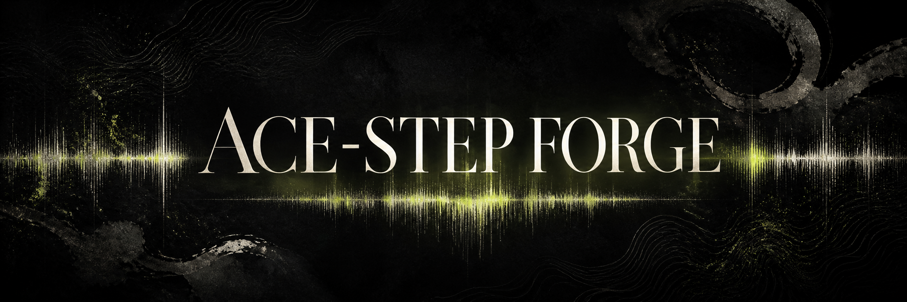
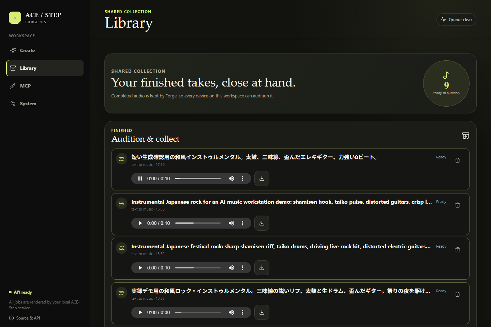

<p align="center">
  
</p>

<h1 align="center">ACE-Step Forge</h1>

<p align="center">
  ACE-Step 1.5 を、ローカルで生成・保存・再生し、MCP 経由でも使えるようにするワークスペース。
</p>

<p align="center">
  <a href="./README.md">English</a> ·
  <a href="https://sunwood-ai-labs.github.io/ace-step-forge/ja/">ドキュメント</a> ·
  <a href="https://github.com/Sunwood-ai-labs/ace-step-forge/issues">Issues</a> ·
  <a href="./LICENSE">MIT License</a>
</p>

> **フォークについて。** Forge は
> [ace-step/ACE-Step-1.5](https://github.com/ace-step/ACE-Step-1.5) を基にした、独立保守の
> MIT フォークです。上流の ACE-Step エンジン・API・Gradio UI は残したまま、React の
> ワークスペース、サーバー共有の Library、Docker Compose 運用、コーディングエージェント向け
> MCP ブリッジを追加しています。ACEMusic および上流 ACE-Step チームとは別のプロジェクトです。

## ✨ Forge の生成フロー



<sub>実際にローカルで動かした Forge で、共有 Library から再生を始めた状態のスクリーンショットです。</sub>

```text
Forge で生成 ──► ACE-Step の生成キュー ──► 共有 Library ──► 再生 / ダウンロード / ビジュアライザMP4
Claude Code / Codex ───────────────────────► 同じキュー ────► 同じ Library
```

- **Create** — プロンプトと生成コントロールを指定し、既存の ACE-Step API に送ります。
- **Library** — 完成した音声は `gradio_outputs/forge-library` に残るため、ブラウザ 1 台だけの
  localStorage ではなく、Forge サービス全体で共有できます。
- **Visualizer** — 完成した曲ごとに横長 16:9 / SNS向け縦長 9:16 を選び、曲名・生成情報・音に
  同期する波形をまとめたローカル H.264/AAC MP4 を作成できます。外部の動画サービスへ音声を
  アップロードしません。
- **MCP** — Claude Code、Codex CLI などから、同じ生成キューを Streamable HTTP で使えます。
- **Legacy Gradio** — 上流公式の Gradio UI も `legacy` Compose profile として残しています。

## ⚡ Docker Compose で起動する

### 必要なもの

- NVIDIA GPU 対応を有効にした Docker Desktop（Linux containers）、または Docker Engine と
  NVIDIA Container Toolkit。
- NVIDIA ドライバと、ACE-Step を実行できる GPU。最初の生成時にはモデルをダウンロード／ロードします。

```powershell
git clone https://github.com/Sunwood-ai-labs/ace-step-forge.git
Set-Location ace-step-forge
Copy-Item .env.example .env

# 数字の GPU 番号より、固定 UUID を推奨します。
nvidia-smi -L
# .env を編集して、例えば次を設定します。
# ACESTEP_GPU_DEVICE_ID=GPU-<your-GPU-uuid>

docker compose up -d --build
docker compose ps
```

ブラウザで <http://localhost:3000> を開きます。

| サービス | ローカル URL | 用途 |
| --- | --- | --- |
| Forge workspace | <http://localhost:3000> | 生成、Library、MCP の使い方、System 状態 |
| ACE-Step REST API | <http://localhost:8001> | スクリプト・連携用 |
| MCP gateway | <http://127.0.0.1:8002/mcp> | ローカルのコーディングエージェント接続用 |
| 上流 Gradio UI | <http://localhost:7860> | `docker compose --profile legacy up acestep-gradio` |

`3000` が使用中なら、`.env` に `FORGE_PORT=3002` を設定してそのポートを開いてください。ブラウザ側は
Forge の同一オリジン `/api` プロキシだけを使います。

### Apple Silicon の M1 を UI エッジにする

モデル/API イメージは CUDA/NVIDIA 前提のため、M1 では ARM64 の Forge UI だけを動かし、
`/api` を Tailscale 経由で既存の GPU ホストへ転送します。
[`deploy/m1/`](./deploy/m1/) の Compose と
[GitHub Actions workflow](./.github/workflows/deploy-m1.yml) が、multi-arch イメージのビルドと
M1 上の self-hosted runner で UI を更新します（初回の runner 登録は SSH で実施できます）。

### 12 GB GPU 向けの実用プロファイル

Compose は `ACESTEP_GPU_DEVICE_ID` で指定した GPU だけを API と optional Gradio に見せます。
`nvidia-smi -L` が表示する UUID を使ってください。Docker Desktop では、コンテナ内の数字の GPU
順序がホストと入れ替わることがあります。

RTX 3060 のような 12 GB GPU では、次の core-generation 設定にすると、起動時に 5 Hz の
言語モデルプランナーをロードせず、VRAM の余裕を確保できます。

```dotenv
ACESTEP_GPU_DEVICE_ID=GPU-<your-GPU-uuid>
ACESTEP_INIT_LLM=false
```

`ACESTEP_INIT_LLM=false` は、別の GPU を空ける／確保する設定ではありません。選択した GPU 上で
optional の 5 Hz planner・LLM 強化入力を無効にし、コアの音楽生成に使う VRAM を抑える設定です。
プランナー機能を使うときは、VRAM に余裕があることを確認して `auto` または `true` に戻します。詳細は
[12 GB GPU 運用ガイド](./docs/ja/GPU_12GB.md)を参照してください。

## 🔌 Claude Code / Codex から音楽を作る

Compose を起動したあと、ローカル専用の Streamable HTTP エンドポイントを登録します。

```powershell
# Claude Code
claude mcp add --transport http ace-step-forge http://127.0.0.1:8002/mcp

# Codex CLI
codex mcp add ace-step-forge --url http://127.0.0.1:8002/mcp
```

利用できるツールは `generate_music`、`get_generation_status`、
`wait_for_generation`、`list_music_library`、`get_music_server_status` の 5 つです。

MCP は既定で `127.0.0.1` にだけ bind します。認証が必要なら `.env` の
`ACESTEP_MCP_API_KEY` を設定し、同じ値を環境変数経由でクライアントに渡してください。Tailscale で
使う場合は、Tailscale Serve/ACLs を利用し、許可する host と公開 API Base URL を明示的に設定します。
Tailnet URL はインターネットへの一般公開 URL ではありません。詳しくは
[MCP ガイド](./docs/ja/MCP.md)を参照してください。

## 📚 ドキュメント

- [Forge ワークスペース概要](./docs/ja/FORGE.md) — ルート、保存場所、API 境界
- [MCP セットアップ](./docs/ja/MCP.md) — Claude Code、Codex、認証、Tailnet
- [12 GB GPU 運用](./docs/ja/GPU_12GB.md) — UUID の選び方とプランナー設定
- [M1 CI/CD デプロイ](./deploy/m1/README.md) — ARM64 UI、self-hosted runner、Tailscale API 接続
- [React UI の設計・QA 契約](./docs/en/REACT_FORGE.md)
- [公式 ACE-Step の導入・モデルガイド](./docs/ja/INSTALL.md)

`docs/` は `main` への push 時に GitHub Pages へ公開されます。

## 🧪 ローカルで変更を確認する

```powershell
docker compose config --quiet
Set-Location frontend
npm ci
npm run test
npm run build
```

リリース前は、短い曲を実際に生成し、**Ready** になるまで待ち、**Library** を開いてブラウザの
オーディオプレーヤーを再生してください。生成と保存済み再生がつながっていることを確認できます。

## 🤝 コントリビュートとライセンス

変更を送る前に [CONTRIBUTING.md](./CONTRIBUTING.md) を読んでください。Forge は
[MIT License](./LICENSE) で公開しています。ACE-Step の上流コードとモデル資料のクレジットは
ACE-Step チームに帰属します。研究・モデル・エコシステムについては
[公式 ACE-Step 1.5 リポジトリ](https://github.com/ace-step/ACE-Step-1.5)を参照してください。

<p align="center">
  <br>
  <sub>ACE-Step Forge アイコン</sub>
</p>
